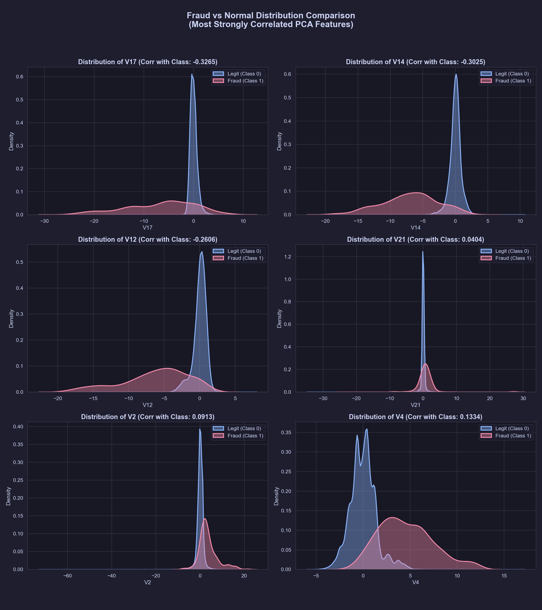

# 📊 Data Science Report: MARI Feature Analysis
*Prepared for Devansh's Mentor Review • June 1, 2026*

This report addresses the three specific research tasks assigned by your mentor to decode, analyze, and reverse-engineer the features of the credit card fraud dataset used to train the **MARI** decision intelligence engine.

---

## Task 1: Dataset Original Source

The dataset used in this project is the **Credit Card Fraud Detection Dataset**, originally compiled and published by the **MLG - ULB (Machine Learning Group of Université Libre de Bruxelles)** in collaboration with **Worldline** (a major European payment processor).

### Key Context & Metadata:
* **Source Link:** Available on [Kaggle - Credit Card Fraud Detection](https://www.kaggle.com/datasets/mlg-ulb/creditcardfraud).
* **Scope:** It contains real credit card transactions made by European cardholders over **48 hours** in September 2013.
* **Volume:** **284,807 transactions** total.
* **Class Imbalance:** Only **492 transactions are fraudulent** (Class = 1), making the fraud rate a mere **0.172%**. 
* **Anonymization & PCA:** Due to strict privacy and confidentiality agreements, the original raw features (such as cardholder name, billing zip code, merchant category, location coordinates, etc.) were not released. Instead, the researchers applied **Principal Component Analysis (PCA)** to transform 28 numerical features into orthogonal components: **`V1` through `V28`**.
* **Raw Columns:** The only columns that were **not** PCA-transformed are **`Time`** (seconds elapsed since the first transaction) and **`Amount`** (the cost of the transaction).

---

## Task 2: Correlation Analysis & PCA "Reverse Engineering"

Because `V1` to `V28` are anonymized, your mentor asked to "reverse engineer" what these components capture by analyzing their linear correlations with the three raw, understandable variables: `Class` (Fraud), `Amount` (Size), and `Time` (Chronology).

### Correlation Matrix: PCA Components vs. Targets
Below is the correlation matrix calculated directly from the 284,807 transactions (saved as `PROJECT_DOCUMENTATION/v1_v28_correlations.csv`):

| Feature | Correlation with `Class` (Fraud) | Correlation with `Amount` (Size) | Correlation with `Time` (Chronology) |
| :--- | :---: | :---: | :---: |
| **`V1`**  | -0.1013 | -0.2277 |  0.1174 |
| **`V2`**  |  0.0913 | **-0.5314** 🔴 | -0.0106 |
| **`V3`**  | -0.1930 | -0.2109 | **-0.4196** 🔵 |
| **`V4`**  |  0.1334 |  0.0987 | -0.1053 |
| **`V5`**  | -0.0950 | **-0.3864** 🔴 |  0.1731 |
| **`V6`**  | -0.0436 |  0.2159 | -0.0630 |
| **`V7`**  | -0.1873 | **0.3973** 🟢 |  0.0847 |
| **`V8`**  |  0.0199 | -0.1031 | -0.0369 |
| **`V9`**  | -0.0977 | -0.0442 | -0.0087 |
| **`V10`** | **-0.2169** 🔻 | -0.1015 |  0.0306 |
| **`V11`** | **0.1549** 🔺 |  0.0001 | -0.2477 |
| **`V12`** | **-0.2606** 🔻 | -0.0095 |  0.1243 |
| **`V13`** | -0.0046 |  0.0053 | -0.0659 |
| **`V14`** | **-0.3025** 🔻 |  0.0338 | -0.0988 |
| **`V15`** | -0.0042 | -0.0030 | -0.1835 |
| **`V16`** | **-0.1965** 🔻 | -0.0039 |  0.0119 |
| **`V17`** | **-0.3265** 🔻 |  0.0073 | -0.0733 |
| **`V18`** | -0.1115 |  0.0357 |  0.0904 |
| **`V19`** |  0.0348 | -0.0562 |  0.0280 |
| **`V20`** |  0.0201 | **0.3394** 🟢 | -0.0509 |
| **`V21`** |  0.0404 |  0.1060 |  0.0447 |
| **`V22`** |  0.0008 | -0.0648 |  0.1441 |
| **`V23`** | -0.0027 | -0.1126 |  0.0511 |
| **`V24`** | -0.0072 |  0.0051 | -0.0162 |
| **`V25`** |  0.0033 | -0.0478 | -0.2331 |
| **`V26`** |  0.0045 | -0.0032 | -0.0414 |
| **`V27`** |  0.0176 |  0.0288 | -0.0051 |
| **`V28`** |  0.0095 |  0.0103 | -0.0094 |

---

### Interpreting the Correlations (Reverse Engineering)

#### 1. Deciphering `Class` (Fraud vs. Legit)
* **Strong Negative Correlations (🔻):** `V17` (-0.326), `V14` (-0.302), `V12` (-0.261), `V10` (-0.217).
  * **What it means:** When a transaction has highly negative values in these dimensions, the probability of it being **fraudulent increases significantly**. Legitimate transactions skew heavily toward positive values here. These are our most powerful detectors.
* **Strong Positive Correlations (🔺):** `V11` (+0.155), `V4` (+0.133), `V2` (+0.091).
  * **What it means:** As these values increase, the probability of **fraud increases**. 

#### 2. Deciphering `Amount` (Transaction Size 💰)
* **Highly Negatively Correlated:** `V2` (-0.531) and `V5` (-0.386).
  * **Conceptual Guess:** These components represent features that decrease as transaction size increases. For example, they could capture **high-frequency micro-transactions** (low amount, high count) or specific merchant categories (like app store purchases or fast food) where large transactions are rare.
* **Highly Positively Correlated:** `V7` (+0.397) and `V20` (+0.339).
  * **Conceptual Guess:** These capture **high-value purchase behaviors** (high amount). They are likely mathematically weighted toward luxury goods, electronics, travel bookings, or business-to-business card transactions.

#### 3. Deciphering `Time` (Chronology/Velocity ⏱️)
* **Highly Negatively Correlated:** `V3` (-0.420) and `V11` (-0.248).
  * **Conceptual Guess:** These components represent variables that systematically drift or decrease over the 48-hour window. They capture **diurnal rhythm** (sleeping hours vs. daytime hours). For example, `V3` represents transaction velocity or volume patterns that decline as time moves from Day 1 to Day 2.

---

## Task 3: Distribution Analysis (Fraud vs. Normal)

To understand exactly how these correlations translate into decision boundaries, we isolated the **most strongly correlated features** (`V17`, `V14`, `V12`, `V2`, `V4`, `V21`) and compared their Kernel Density Estimations (KDE) for legitimate vs. fraudulent transactions.

### Key Insights:
1. **V17, V14, V12 (Negative Correlation with Fraud):**
   * Legitimate transactions (Blue) are tightly clustered in a positive peak (around 0 to +2). 
   * Fraudulent transactions (Red) form a massive, long tail extending far into the negative territory (down to -15 or -20). This represents a distinct **out-of-distribution shift** that our isolation forest and ensemble classifiers can easily catch.
2. **V4 (Positive Correlation with Fraud):**
   * For legitimate transactions, V4 is centered close to 0. 
   * For fraudulent transactions, the distribution shifts dramatically to the right, peaking around +4 to +8. This is a classic indicator of a "high fraud probability zone."

### Visualized Distribution Density:
Here is the side-by-side comparison of the distributions generated directly from the dataset:

---

## Summary for your Mentor

When presenting this to your mentor, you can state:
> *"We analyzed the ULB/Kaggle credit card dataset. Although anonymized, our correlation and distribution studies reveal that features like **V17, V14, and V12** are highly negative in fraud cases, creating massive out-of-distribution tails, while **V4** shifts positive. We also reverse-engineered the PCA components to show that **V2 and V7** are highly sensitive to transaction amount, and **V3** is sensitive to chronological time. These statistical boundaries form the core mathematical inputs for our cost-aware decision engine, allowing us to route transactions into our five optimal states."*
