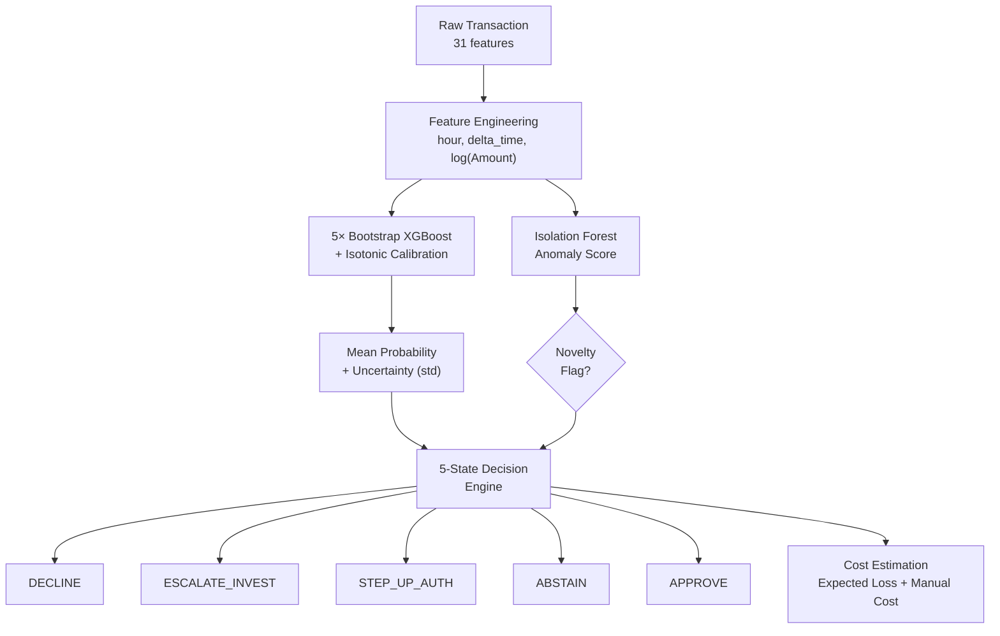

# MARI – Every Formula & Decision Rule

A complete reference of how raw transaction data becomes an **APPROVE / DECLINE / ESCALATE / STEP_UP / ABSTAIN** decision.

---

## 1. Feature Engineering (Phase 0)

| Formula | Purpose |
|---|---|
| `hour = (Time / 3600) % 24` | Convert seconds-since-epoch into a cyclic hour-of-day feature |
| `delta_time = Time.diff()` | Time gap between consecutive transactions (velocity signal) |
| `Amount = log(1 + Amount)` | Log-transform to compress the heavy right-skewed distribution |

- Raw `Time` column is **dropped** after deriving `hour` and `delta_time`.
- `delta_time` for the first row is filled with `0`.

---

## 2. Class Imbalance Handling

```
scale_pos_weight = (total_negative_samples) / (total_positive_samples)
                 = (len(y_train) − y_train.sum()) / y_train.sum()
```

This tells XGBoost to treat each fraud sample as if it were ~577× more important than a legit sample (matching the ~0.17% fraud rate).

---

## 3. Model: Calibrated XGBoost Ensemble (Phases 1–2)

### 3a. Base XGBoost

```
XGBClassifier(
    n_estimators   = 300,
    max_depth      = 4,
    learning_rate  = 0.05,
    scale_pos_weight = <computed above>,
    eval_metric    = "logloss"
)
```
Outputs raw probability via gradient-boosted trees.

### 3b. Isotonic Calibration

```
CalibratedClassifierCV(base_model, method="isotonic", cv=3)
```

Wraps the base model so that its outputted probabilities are **well-calibrated** — i.e., when the model says "70% fraud", ~70% of those cases really are fraud. Uses 3-fold cross-validation internally.

### 3c. Bootstrap Ensemble (Phase 2)

```python
for seed in range(5):
    indices = np.random.choice(len(X_train), len(X_train), replace=True)
    # train a new Calibrated XGBoost on this bootstrap sample
```

5 models, each trained on a **different bootstrap resample** of the training data.

---

## 4. Risk Score & Uncertainty (Phase 2)

| Metric | Formula | Meaning |
|---|---|---|
| **Risk Score** (probability) | `mean_prob = mean(prob₁, prob₂, …, prob₅)` | Average fraud probability across 5 ensemble members |
| **Uncertainty** | `uncertainty = std(prob₁, prob₂, …, prob₅)` | Standard deviation of the 5 predictions — measures how much the models **disagree** |

> **Key insight**: A transaction can be "high risk" but also "high uncertainty" — meaning the models aren't sure. This 2D signal is critical for routing decisions.

---

## 5. Anomaly Detection (Phase 4 – Isolation Forest)

### 5a. Training

```
IsolationForest(n_estimators=200, contamination=0.001)
```

Trained **only on legitimate transactions** — learns what "normal" looks like.

### 5b. Scoring

```python
raw_score     = iso.decision_function(X)   # higher = more normal
anomaly_score = -raw_score                 # flipped: higher = more anomalous
```

### 5c. Novelty Flag (Production Engine)

```python
novelty_flag = raw_score < anomaly_threshold   # threshold = -0.08
```

If `True`, the transaction is **structurally unlike anything** in the training data — a pattern the XGBoost has never seen.

### 5d. Separation Check (Research Phase)

```python
threshold = np.percentile(legit_anomaly_scores, 99.9)
predicted_anomaly = anomaly_score > threshold
detection_rate = detected_fraud / total_fraud
```

---

## 6. Optimal Threshold Selection (Phase 1 XGBoost)

```python
best_threshold = None
best_precision = 0

for precision, recall, threshold in precision_recall_curve(y_test, y_prob):
    if recall >= 0.85 and precision > best_precision:
        best_precision = precision
        best_recall    = recall
        best_threshold = threshold      # → found: 0.1164

F1 = 2 × (precision × recall) / (precision + recall)
```

> **Goal**: Find the threshold that maximises precision **while keeping recall ≥ 85%** (catch at least 85% of all fraud).

---

## 7. Decision Routing — The 5-State Engine

This is the **core brain** of the system. It sits in [decision_engine.py](file:///c:/Users/Devansh/Desktop/Risk%20Aware%20Fraud%20Transaction%20Decision%20System/backend/engine/decision_engine.py).

### Thresholds (Production)

| Parameter | Value | Meaning |
|---|---|---|
| `decline_threshold` | **0.80** | Above this → almost certainly fraud |
| `escalate_threshold` | **0.60** | Above this + uncertain → needs investigation |
| `auth_threshold` | **0.30** | Above this → medium risk zone |
| `uncertainty_threshold` | **0.02** | Above this → models disagree significantly |
| `anomaly_threshold` | **−0.08** | Below this → novel pattern never seen before |

### Decision Matrix

```
                        Low Uncertainty          High Uncertainty
                        (U < 0.02)               (U ≥ 0.02)
                    ┌─────────────────────┬────────────────────────┐
  High Risk         │                     │                        │
  (P ≥ 0.80)       │    ❌ DECLINE        │  🔍 ESCALATE_INVEST    │
                    ├─────────────────────┼────────────────────────┤
  Medium Risk       │                     │                        │
  (0.30 ≤ P < 0.80)│    🔐 STEP_UP_AUTH   │  🔐 STEP_UP_AUTH       │
                    ├─────────────────────┼────────────────────────┤
  Low Risk          │                     │                        │
  (P < 0.30)        │    ✅ APPROVE        │  ⏸️ ABSTAIN             │
                    └─────────────────────┴────────────────────────┘

  🚨 Novelty Override: If novelty_flag=True → ESCALATE_INVEST (regardless of above)
```

### What Each Decision Means

| Decision | Action | When |
|---|---|---|
| **DECLINE** | Auto-block the transaction | High risk, low uncertainty — system is confident it's fraud |
| **ESCALATE_INVEST** | Flag for fraud investigator | High risk + uncertain, OR novel pattern detected |
| **STEP_UP_AUTH** | Request additional auth (OTP, biometric) | Medium risk — could go either way |
| **ABSTAIN** | Hold for manual review | Low risk score but models disagree — don't trust the "safe" prediction |
| **APPROVE** | Auto-approve | Low risk, low uncertainty — system is confident it's legitimate |

---

## 8. Cost Estimation

The engine computes a financial impact estimate for every transaction:

```
Expected Loss    = probability × fraud_cost        (prob × $1000)
Manual Cost      = $20   if decision ∈ {STEP_UP_AUTH, ESCALATE_INVEST, ABSTAIN}
                   $0    otherwise
Net Utility      = −Expected_Loss − Manual_Cost
```

### Business Cost Simulation (Phase 2 Research)

| Cost Type | Value | Applied When |
|---|---|---|
| `C_FN` (missed fraud) | **$5,000** | AUTO_APPROVE but was actually fraud |
| `C_FP_block` (false block) | **$200** | AUTO_BLOCK but was actually legit |
| `C_manual` (review cost) | **$50** | MANUAL_REVIEW or ABSTAIN |
| `C_step_up` (step-up cost) | **$10** | STEP_UP_AUTH |
| `C_escalate` (investigation cost) | **$100** | ESCALATE_INVEST |

```
Total System Cost  = Σ (per-transaction cost based on decision vs reality)
Avg Cost/Txn       = Total System Cost / number of transactions
```

---

## 9. Risk Tier Classification

```python
def tier(prob):
    if prob >= 0.80:  return "high_risk"
    if prob >= 0.30:  return "medium_risk"
    return "low_risk"
```

---

## 10. Reliability Validation (Phase 5)

### Brier Score — measures probability accuracy

```
Brier Score = (1/N) × Σ (predicted_prob − actual_label)²
```

Lower = better. Compared between raw XGBoost and calibrated XGBoost to prove calibration improves reliability.

### Calibration Curve

Bins predicted probabilities into 10 buckets and checks: *"Of all transactions where we predicted ~X% fraud, what fraction actually were fraud?"*

Perfect calibration = points lie on the diagonal `y = x`.

---

## 11. Explainability (Phase 3 — SHAP)

```python
explainer   = shap.TreeExplainer(model)
shap_values = explainer.shap_values(X_test)
```

For each individual transaction, SHAP decomposes the prediction into per-feature contributions:

```
prediction = base_value + Σ (SHAP_value_per_feature)
```

- **Positive SHAP value** → feature pushed the prediction **toward fraud**
- **Negative SHAP value** → feature pushed the prediction **toward legitimate**
- **Global summary plot** → which features matter most across all transactions

---

## Summary: Full Pipeline Flow


